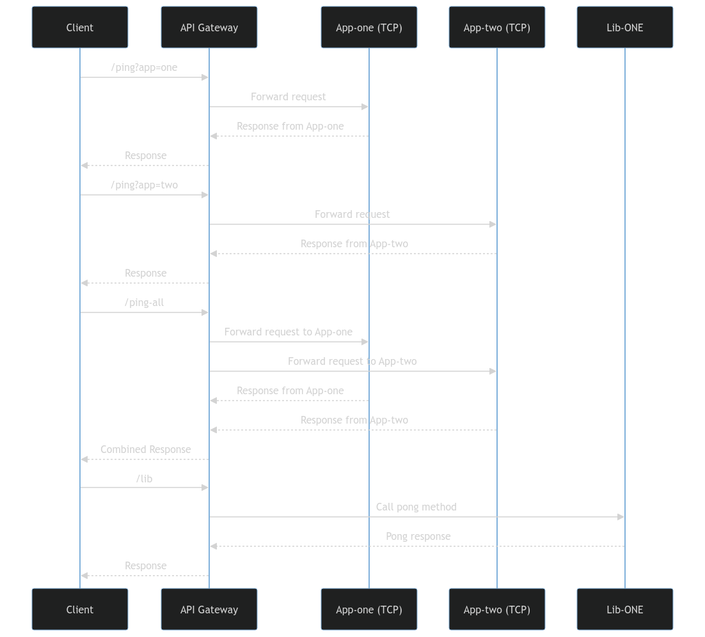

# NestJS Project using Monorepo with Microservices and Shared Libraries

<p>This project is a monorepo setup using NestJS, featuring multiple microservices, an API Gateway, and shared libraries.</p>

>The project demonstrates a modular architecture where microservices can be independently developed, deployed, and scaled.

## Project Structure

- **API Gateway**: Serves as the entry point for all client requests. Routes requests to the appropriate microservice or handles them using shared libraries.
- **App-one**: A microservice that exposes its functionality via TCP on `APP_ONE_PORT`.
- **App-two**: Another microservice, similar to `App-one`, but exposed on `APP_TWO_PORT`.
- **Lib-one**: A shared library used across the microservices and the API Gateway.

## Endpoints

The API Gateway exposes the following endpoints:

- **`/ping?app=one`**: Forwards the request to `App-one` and returns the response.
- **`/ping?app=two`**: Forwards the request to `App-two` and returns the response.
- **`/ping-all`**: Forwards requests to both `App-one` and `App-two`, and returns a combined response.
- **`/lib`**: Utilizes the `pong` method from the shared `Lib-one` library and returns the response.

## Sequence Diagram

The following sequence diagram illustrates the flow of requests and responses between the client, API Gateway, microservices, and shared libraries:



#### Diagram Description

- `GET - /ping?app=one`
   - The client sends a request to the /ping?app=one endpoint.
   - The API Gateway forwards this request to App-one.
   - App-one sends a response back to the API Gateway.
   - The API Gateway returns the response to the client.
- `GET - /ping?app=two`
   - Similar to the first sequence, but the request is forwarded to App-two instead.
- `GET - /ping-all`
  - The client sends a request to /ping-all.
  - The API Gateway forwards requests to both App-one and App-two.
  - Both microservices return their responses, which the API Gateway combines and sends back to the client.
- `GET - /lib`
  - The client requests the /lib endpoint.
  - The API Gateway calls the pong method from the shared Lib-ONE library.
  - The response is sent back to the client.


## Installation

```bash
$ pnpm install
```

## Running the app

```bash
# development
$ pnpm run start:dev

# debug mode
$ pnpm run start:debug
```

## Test

```bash
# unit tests
$ pnpm run test

# e2e tests
$ pnpm run test:e2e

# test coverage
$ pnpm run test:cov
```

## Stay in touch

- Author - [Felipe Moura](https://felipewom.dev)
- References 
  - [Nest Monorepo](https://docs.nestjs.com/recipes/swc#monorepo)
  - [Nest Microservices](https://docs.nestjs.com/microservices/basics)
  - [Nest Shared Libraries](https://docs.nestjs.com/cli/monorepo#libraries)

## License

Nest is [MIT licensed](LICENSE).
